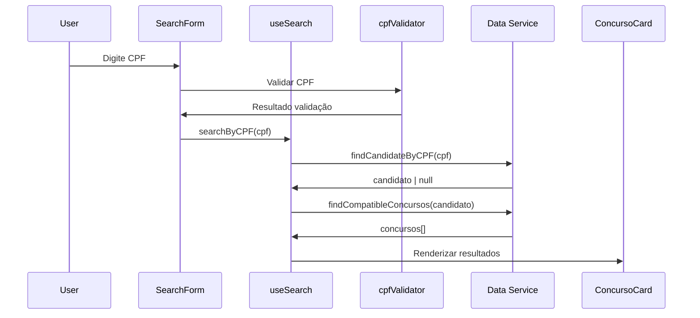
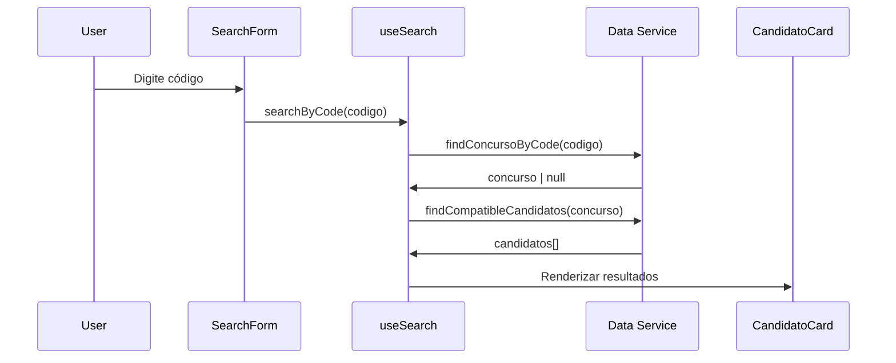

# 📚 Documentação da API Interna

## 🔍 Visão Geral

Este documento detalha as interfaces, tipos e estruturas de dados utilizadas no Sistema de Consulta de Concursos LEDS IFES.

## 📊 Estruturas de Dados

### Candidato
```typescript
interface Candidato {
  /** Nome completo do candidato */
  nome: string;
  
  /** Data de nascimento no formato DD/MM/AAAA */
  dataNascimento: string;
  
  /** CPF formatado com pontos e hífen */
  cpf: string;
  
  /** Lista de profissões do candidato */
  profissoes: string[];
}
```

**Exemplo:**
```typescript
const candidato: Candidato = {
  nome: "Jackie Dawson",
  dataNascimento: "14/08/1970",
  cpf: "311.667.973-47",
  profissoes: ["marceneiro", "assistente administrativo"]
}
```

### Concurso
```typescript
interface Concurso {
  /** Órgão responsável pelo concurso */
  orgao: string;
  
  /** Número do edital */
  edital: string;
  
  /** Código único do concurso */
  codigo: string;
  
  /** Lista de vagas disponíveis */
  vagas: string[];
}
```

**Exemplo:**
```typescript
const concurso: Concurso = {
  orgao: "SEJUS",
  edital: "15/2017",
  codigo: "61828450843",
  vagas: ["carpinteiro", "professor de matemática", "assistente administrativo"]
}
```

### SearchResult
```typescript
interface SearchResult<T> {
  /** Dados encontrados na busca */
  data: T[];
  
  /** Indica se a busca está em andamento */
  loading: boolean;
  
  /** Mensagem de erro, se houver */
  error: string | null;
}
```

## 🛠️ Hooks Personalizados

### useSearch
Hook principal para funcionalidades de busca.

```typescript
interface UseSearchReturn {
  /** Resultados da última busca */
  results: (Candidato | Concurso)[];
  
  /** Estado de carregamento */
  loading: boolean;
  
  /** Mensagem de erro atual */
  error: string | null;
  
  /** Buscar concursos por CPF */
  searchByCPF: (cpf: string) => Promise<void>;
  
  /** Buscar candidatos por código */
  searchByCode: (codigo: string) => Promise<void>;
  
  /** Limpar resultados e erros */
  clearResults: () => void;
}

const useSearch = (): UseSearchReturn
```

**Exemplo de uso:**
```typescript
const { results, loading, error, searchByCPF } = useSearch();

const handleSearch = async () => {
  await searchByCPF('182.845.084-34');
  // results conterá os concursos compatíveis
};
```

### useAccessibility
Hook para controles de acessibilidade.

```typescript
type FontSize = 'small' | 'medium' | 'large';

interface UseAccessibilityReturn {
  /** Tamanho atual da fonte */
  fontSize: FontSize;
  
  /** Estado do alto contraste */
  highContrast: boolean;
  
  /** Alterar tamanho da fonte */
  changeFontSize: (size: FontSize) => void;
  
  /** Alternar alto contraste */
  toggleHighContrast: () => void;
  
  /** Anunciar mensagem para leitores de tela */
  announceToScreenReader: (message: string) => void;
  
  /** Gerar ID único para acessibilidade */
  generateId: (prefix?: string) => string;
}

const useAccessibility = (): UseAccessibilityReturn
```

### useBreakpoint
Hook para detecção de breakpoints responsivos.

```typescript
type Breakpoint = 'xs' | 'sm' | 'md' | 'lg' | 'xl' | '2xl';

interface UseBreakpointReturn {
  /** Breakpoint atual */
  breakpoint: Breakpoint;
  
  /** Verdadeiro se for mobile (xs, sm) */
  isMobile: boolean;
  
  /** Verdadeiro se for tablet (md) */
  isTablet: boolean;
  
  /** Verdadeiro se for desktop (lg+) */
  isDesktop: boolean;
  
  /** Breakpoints específicos */
  isXs: boolean;
  isSm: boolean;
  isMd: boolean;
  isLg: boolean;
  isXl: boolean;
  is2Xl: boolean;
}

const useBreakpoint = (): UseBreakpointReturn
```

### usePWA
Hook para funcionalidades PWA.

```typescript
interface UsePWAReturn {
  /** Indica se a app pode ser instalada */
  isInstallable: boolean;
  
  /** Indica se há atualização disponível */
  updateAvailable: boolean;
  
  /** Indica se está offline */
  isOffline: boolean;
  
  /** Instalar a aplicação */
  installApp: () => Promise<void>;
  
  /** Aplicar atualização */
  applyUpdate: () => void;
}

const usePWA = (): UsePWAReturn
```

## 🔧 Utilitários

### cpfValidator
Funções para validação e formatação de CPF.

```typescript
/**
 * Valida um CPF usando o algoritmo oficial brasileiro
 * @param cpf CPF em qualquer formato
 * @returns true se válido, false caso contrário
 */
function validateCPF(cpf: string): boolean

/**
 * Formata um CPF com máscara
 * @param cpf CPF sem formatação
 * @returns CPF formatado (000.000.000-00)
 */
function formatCPF(cpf: string): string

/**
 * Remove formatação do CPF
 * @param cpf CPF formatado
 * @returns apenas números
 */
function cleanCPF(cpf: string): string
```

**Exemplos:**
```typescript
validateCPF('182.845.084-34'); // true
validateCPF('123.456.789-00'); // false

formatCPF('18284508434'); // '182.845.084-34'
cleanCPF('182.845.084-34'); // '18284508434'
```

### listIntersection
Funções para comparação de listas.

```typescript
/**
 * Verifica se duas listas têm interseção
 * @param list1 Primeira lista
 * @param list2 Segunda lista
 * @returns true se há interseção
 */
function hasIntersection(list1: string[], list2: string[]): boolean

/**
 * Encontra elementos em comum entre listas
 * @param list1 Primeira lista
 * @param list2 Segunda lista
 * @returns elementos em comum
 */
function findIntersection(list1: string[], list2: string[]): string[]

/**
 * Normaliza string para comparação
 * @param str String original
 * @returns string normalizada (sem acentos, lowercase)
 */
function normalizeString(str: string): string
```

**Exemplos:**
```typescript
hasIntersection(['carpinteiro'], ['carpinteiro', 'professor']); // true
hasIntersection(['médico'], ['carpinteiro', 'professor']); // false

findIntersection(['a', 'b'], ['b', 'c']); // ['b']
normalizeString('Carpinteiro'); // 'carpinteiro'
```

## 🎨 Componentes de Interface

### CandidatoCard
Exibe informações de um candidato.

```typescript
interface CandidatoCardProps {
  /** Dados do candidato */
  candidato: Candidato;
  
  /** Callback ao selecionar candidato */
  onSelect?: (candidato: Candidato) => void;
  
  /** Classes CSS adicionais */
  className?: string;
  
  /** Destacar profissões específicas */
  highlightProfissoes?: string[];
}

const CandidatoCard: React.FC<CandidatoCardProps>
```

### ConcursoCard
Exibe informações de um concurso.

```typescript
interface ConcursoCardProps {
  /** Dados do concurso */
  concurso: Concurso;
  
  /** Callback ao selecionar concurso */
  onSelect?: (concurso: Concurso) => void;
  
  /** Classes CSS adicionais */
  className?: string;
  
  /** Destacar vagas específicas */
  highlightVagas?: string[];
}

const ConcursoCard: React.FC<ConcursoCardProps>
```

### SearchForm
Formulário genérico de busca.

```typescript
interface SearchFormProps {
  /** Tipo de busca */
  type: 'cpf' | 'codigo';
  
  /** Callback ao submeter */
  onSubmit: (value: string) => void;
  
  /** Estado de carregamento */
  loading?: boolean;
  
  /** Mensagem de erro */
  error?: string | null;
  
  /** Placeholder personalizado */
  placeholder?: string;
}

const SearchForm: React.FC<SearchFormProps>
```

### AccessibilityControls
Controles de acessibilidade.

```typescript
interface AccessibilityControlsProps {
  /** Posição dos controles */
  position?: 'top-right' | 'top-left' | 'bottom-right' | 'bottom-left';
  
  /** Ocultar controles */
  hidden?: boolean;
  
  /** Classes CSS adicionais */
  className?: string;
}

const AccessibilityControls: React.FC<AccessibilityControlsProps>
```

## 🔄 Fluxos de Dados

### Busca por CPF


### Busca por Código


## ⚡ Performance e Otimizações

### Memoização
```typescript
// Componentes memoizados para evitar re-renders
const CandidatoCard = React.memo(({ candidato, onSelect }) => {
  // implementação
});

// Callbacks memoizados
const handleSearch = useCallback(async (cpf: string) => {
  // lógica de busca
}, []);

// Valores computados memoizados
const filteredResults = useMemo(() => {
  return results.filter(/* critério */);
}, [results]);
```

### Lazy Loading
```typescript
// Carregamento sob demanda de páginas
const BuscarConcursos = lazy(() => import('./pages/BuscarConcursos'));
const BuscarCandidatos = lazy(() => import('./pages/BuscarCandidatos'));

// Wrapping com Suspense
<Suspense fallback={<Loading />}>
  <Routes>
    <Route path="/buscar-concursos" element={<BuscarConcursos />} />
    <Route path="/buscar-candidatos" element={<BuscarCandidatos />} />
  </Routes>
</Suspense>
```

## 🛡️ Tratamento de Erros

### Tipos de Erro
```typescript
interface AppError {
  type: 'validation' | 'network' | 'not-found' | 'server';
  message: string;
  details?: any;
}

const ErrorBoundary: React.FC<{ children: React.ReactNode }> = ({ children }) => {
  // implementação do error boundary
};
```

### Validações
```typescript
const validateSearchInput = (input: string, type: 'cpf' | 'codigo'): AppError | null => {
  if (!input.trim()) {
    return { type: 'validation', message: 'Campo obrigatório' };
  }
  
  if (type === 'cpf' && !validateCPF(input)) {
    return { type: 'validation', message: 'CPF inválido' };
  }
  
  return null;
};
```

## 📱 Responsividade

### Breakpoints
```typescript
const breakpoints = {
  xs: '475px',   // Smartphones pequenos
  sm: '640px',   // Smartphones grandes
  md: '768px',   // Tablets
  lg: '1024px',  // Laptops
  xl: '1280px',  // Desktops
  '2xl': '1536px' // Telas grandes
} as const;
```

### Hooks Responsivos
```typescript
const { isMobile, isTablet, isDesktop } = useBreakpoint();

// Renderização condicional
if (isMobile) {
  return <MobileLayout />;
}

return <DesktopLayout />;
```

Esta documentação fornece uma visão completa da API interna e estruturas de dados utilizadas no sistema.