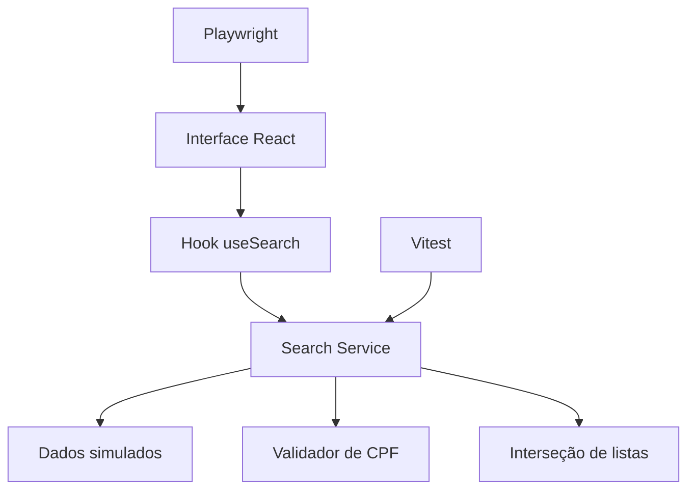

<div align="center">

# CONCURSO LOW-CODE SEEKER

### Sistema de compatibilidade entre candidatos, profissões e concursos públicos

[](https://react.dev/)
[](https://vitest.dev/)
[](https://www.docker.com/)
[](https://github.com/features/actions)

</div>

---

## Contexto

Projeto desenvolvido para o **Desafio Low/No Code do LEDS IFES**. A aplicação consulta compatibilidade entre candidatos e concursos públicos com base na interseção entre profissões declaradas e vagas disponíveis.

O projeto demonstra organização de uma aplicação React em páginas, componentes, serviços, hooks, tipos, utilitários e dados simulados.

---

## Problema e solução

A aplicação oferece dois fluxos principais:

1. **Concursos por candidato:** o usuário informa um CPF e recebe os concursos compatíveis com as profissões cadastradas para aquele candidato.
2. **Candidatos por concurso:** o usuário informa o código de um concurso e recebe os candidatos que possuem ao menos uma profissão compatível com as vagas.

A regra de negócio principal é implementada em uma camada de serviço independente da interface.

---

## Funcionalidades

- consulta por CPF;
- consulta por código de concurso;
- máscara, limpeza e validação de CPF;
- comparação entre listas de profissões e vagas;
- estados de carregamento, sucesso, ausência de resultado e erro;
- mensagens para candidato ou concurso inexistente;
- interface responsiva;
- testes unitários e testes end-to-end;
- execução por container;
- validação automatizada em GitHub Actions.

---

## Arquitetura



| Camada | Responsabilidade |
|:---|:---|
| `pages/` | Fluxos principais e composição das telas |
| `components/` | Componentes reutilizáveis |
| `hooks/` | Estados e integração entre UI e serviço |
| `services/` | Regras de busca e compatibilidade |
| `utils/` | CPF, máscaras e comparação de listas |
| `types/` | Contratos TypeScript |
| `data/` | Dados simulados fornecidos para o desafio |

---

## Stack

`React` • `TypeScript` • `Vite` • `React Router` • `Tailwind CSS` • `Shadcn/UI` • `Vitest` • `Playwright` • `Docker` • `GitHub Actions`

---

## Execução local

```bash
git clone https://github.com/matheusflorindo32/concurso-low-code-seeker.git
cd concurso-low-code-seeker
npm install
npm run dev
```

### Testes e build

```bash
npm run test
npm run build
```

Consulte o `package.json` para os scripts adicionais disponíveis no projeto.

---

## Execução com Docker

```bash
docker build -t concurso-low-code-seeker .
docker run --rm -p 8080:80 concurso-low-code-seeker
```

---

## Dados de demonstração

Os dados utilizados seguem o enunciado do desafio e são **simulados**. O projeto não consulta bases governamentais nem processa dados reais de candidatos.

Essa limitação é intencional e mantém a solução aderente ao escopo acadêmico.

---

## Decisões técnicas

- lógica de compatibilidade separada da camada visual;
- tipagem explícita dos candidatos, profissões e concursos;
- funções utilitárias isoladas para facilitar testes;
- hook dedicado aos estados de busca;
- automação de build e validação;
- documentação sem tratar o protótipo acadêmico como sistema governamental em produção.

---

## Autor

**Matheus Florindo de Deus**  
Estudante de Análise e Desenvolvimento de Sistemas — IFES

[](https://github.com/matheusflorindo32)
[](https://www.tropacientifica.com)
